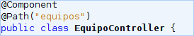
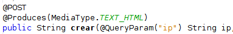

# ¿Cómo contribuir al proyecto?
Aton está escrito en Java, HTML y AngularJS. Se ha utilizado el `modelo vista-controlador`.

## Arquitectura


## Estructura de carpetas

El proyecto tiene la siguiente estructura de carpetas

```
src/
├── main
│   ├── java
│   │   └── org
│   │       └── sunnycake
│   │           └── aton
│   │               ├── controller
│   │               ├── dao
│   │               │   └── impl
│   │               ├── dto
│   │               ├── exception
│   │               ├── exec
│   │               ├── mapping
│   │               └── service
│   │                   └── impl
│   ├── resources
│   └── webapp
│       ├── estilos
│       ├── js
│       ├── META-INF
│       └── WEB-INF
│           └── mapping
└── test
    └── java
```

# Paquetes Java:

## `org.sunnycake.aton.controller`
Ubicación de los servlets que escuchan las peticiones `HTTP` (`GET` y `POST` principalmente). Estos servlets utilizan el framework [Jersey](https://jersey.java.net/) por lo cual se puede de forma sencilla agregar simplemente tags para marcar qué solicitudes debería de responder cada parte.

** Clase: ** 


** Paquete: ** 


Cualquier controlador nuevo puede simplemente ser agregado en este paquete y será reconocido por la aplicación. Las clases de este paquete deberán tener interacción únicamente con los servicios y la vista (Usuario).

## `org.sunnycake.aton.dao`
De las siglas *Data Access Object*, se encarga de crear un puente a la librería Hibernate, la cual según la configuración del mapeo realiza transacciones sobre la bsae de datos.
